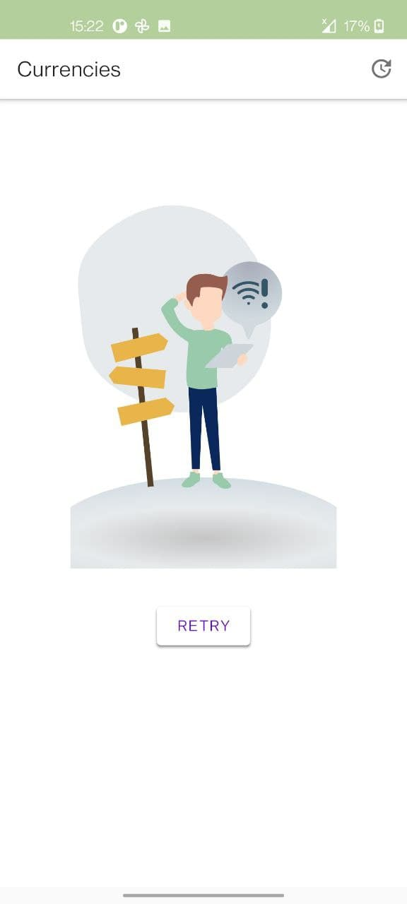
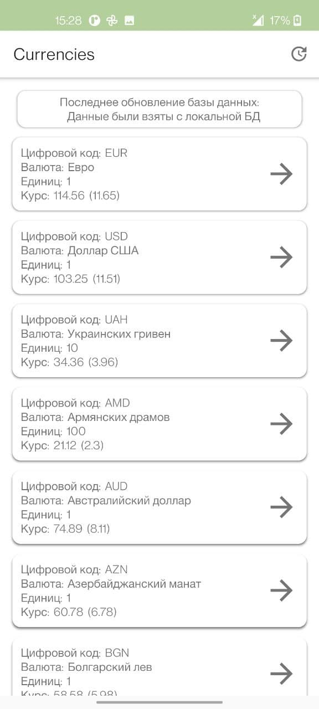
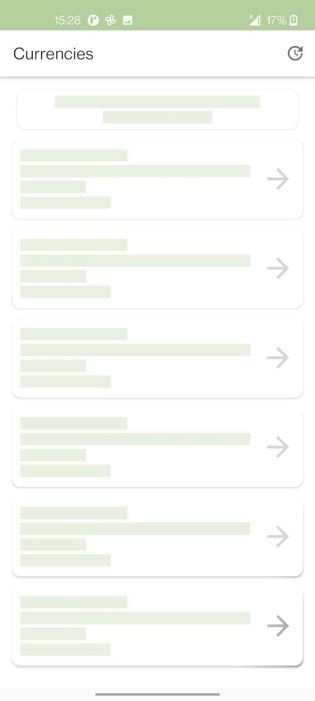
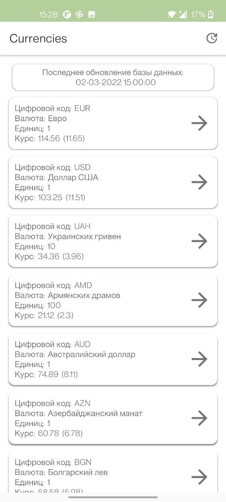
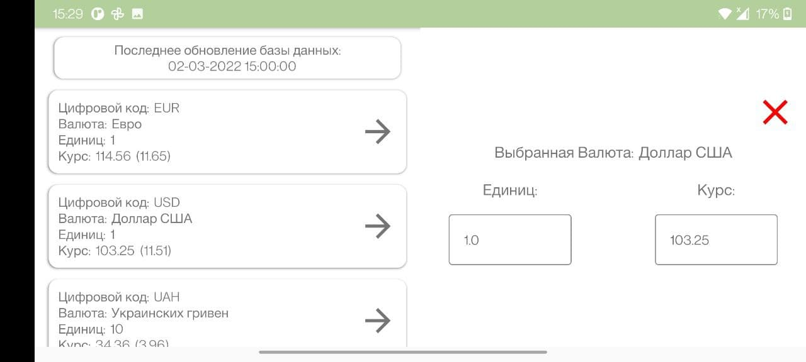

# Проект в ЦФТ

1. Описание
   #### В проекте реализованны следующие функции:
   #### Состояние экрана. 
   Состояние ошибки, когда не было загруженно никаких данных, и устройство не подключенно к интернету 
   
   
   
   Состояния кеширования информации с базы данных (ранее было подключение к интернету, и был загружен список валют)
   
   
   
   Состояние загрузки (Shimmer эффект во время обновлени данных)
   
   
   
   Состояние успеха (загрузка данных с апи и показ списка)
   
   
   
   ## Поддержка переворота экрана:
   Приложение поддерживает вертикальную и горизонтальную ориентацию.
   
   
   
   ## Задачи:
   Загрузка список валют и отображение в виде списка.
   
   Конвертация валюты
   
   Сохранение послдедних загруженных данных при запуске приложения, загрузка списка вручную, сохранение данных при перевороте экрана
   
   Обновление курса валют каждые 5 сек
   
   
   
